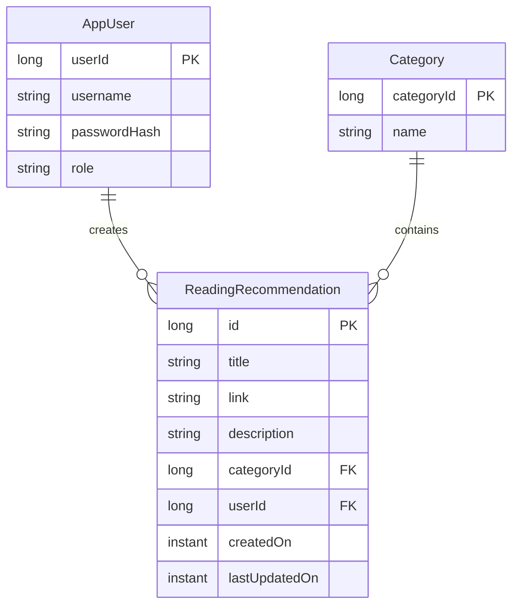

# Entity Relationship Diagram 

## Verbal description of the entities

### Reading Recommendation
The `ReadingRecommendation` entity represents a recommendation for reading created by a user. The entity is associated with a specific `Category` and `AppUser`. A `ReadingRecommendation` can be associated with only one `AppUser` and one `Category`.

#### Attributes:
- **id**: A unique identifier serving as the primary key.
- **title**: The title of the reading recommendation.
- **link**: A link associated with the reading recommendation.
- **description**: A textual description of the reading recommendation.
- **categoryId**: A foreign key referencing the primary key (`categoryId`) in the Category entity, indicating the category to which the reading recommendation belongs.
- **userId**: A foreign key referencing the primary key (`userId`) in the AppUser entity, representing the user who created the reading recommendation.
- **createdOn**: An instant representing the date and time when the reading recommendation was created.
- **lastUpdatedOn**: An instant representing the date and time of the last update to the reading recommendation.

### AppUser
The `AppUser` entity represents a user of the application. `AppUser` are associated with `ReadingRecommendation`. One `AppUser` can be associated with zero or more `ReadingRecommendations`.

#### Attributes:
- **userId:** A unique identifier serving as the primary key.
- **username:** The username associated with the user.
- **passwordHash:** The hashed password of the user.
- **role:** The role or type of the user.

### Category
The `Category` entity represents a category or genre to which a reading recommendation belongs. A `Category` associates with `ReadingRecommendation`. One `Category` can be associated with zero or more `ReadingRecommendations`. 

#### Attributes:
- **categoryId:** A unique identifier serving as the primary key.
- **name:** The name of the category.

## Relationships
An `AppUser` can create zero or many `ReadingRecommendations`, and a `ReadingRecommendation` can only belong to one `AppUser`

A `Category` can contain many `ReadingRecommendations`, and a `ReadingRecommendation` can only belong to one `Category`
